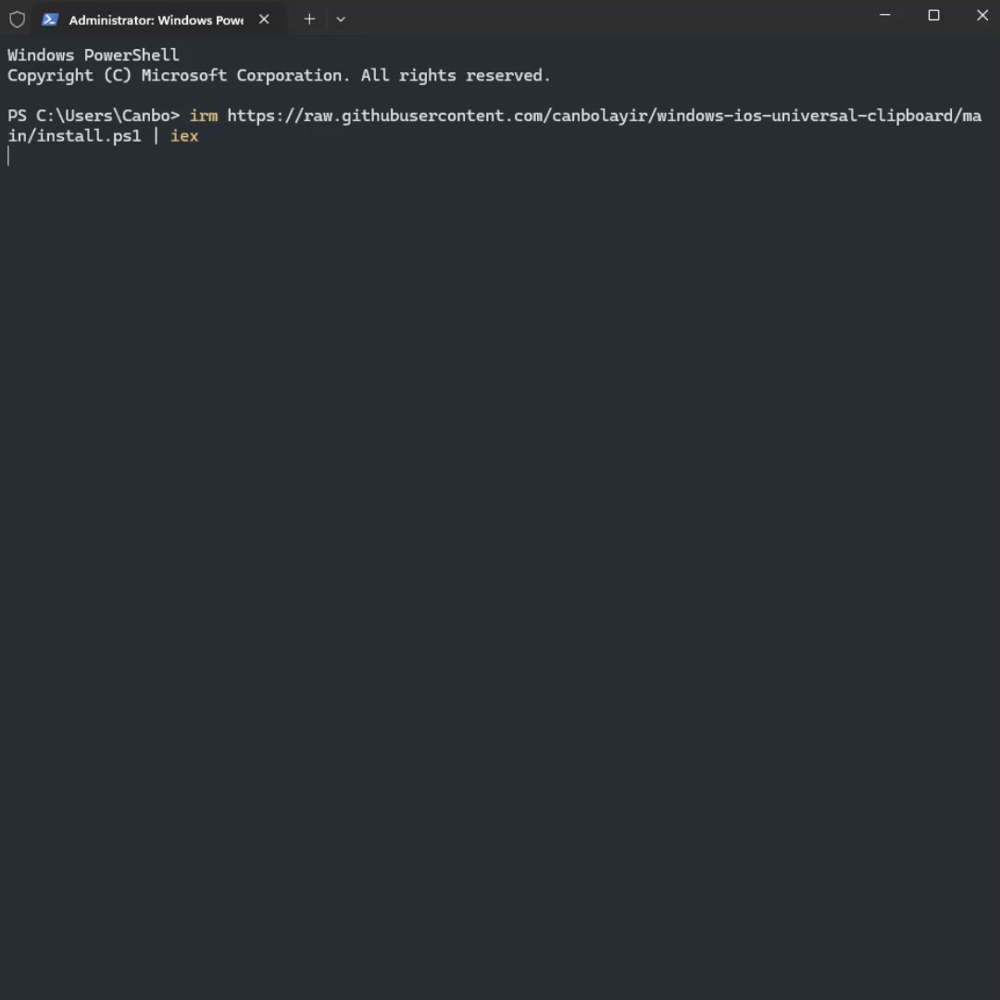

<div align="center">

# Windows iOS Universal Clipboard

### Copiez sur iPhone. Collez sur Windows.

Un petit pont simple pour copier du texte de l’iPhone vers Windows comme avec Universal Clipboard.

[English](README.md) · [Türkçe](README.tr.md) · [Español](README.es.md) · [简体中文](README.zh-CN.md) · [हिन्दी](README.hi.md) · [العربية](README.ar.md) · [Português](README.pt-BR.md) · [Français](README.fr.md) · [Русский](README.ru.md) · [日本語](README.ja.md)

</div>

---

## 🎬 Vidéo d’installation

[Cliquez sur l’image pour voir l’installation complète.](docs/setup.mp4)

[](docs/setup.mp4)

---

## 1. Installation

Ouvrez **PowerShell** sur Windows et exécutez :

```powershell
irm https://raw.githubusercontent.com/canbolayir/windows-ios-universal-clipboard/main/install.ps1 | iex
```

## 2. Configurer l’iPhone

**[Ajouter le Raccourci iPhone](https://www.icloud.com/shortcuts/e870980e381e4675a27af38c91db1265)**

1. Ouvrez sur l’iPhone le lien du Raccourci ci-dessous.
2. Touchez **Get Shortcut**.
3. Touchez **Add Shortcut**.
4. Ouvrez le nouveau Raccourci.
5. Touchez une fois le bouton **▶** en bas à droite.
6. Quand l’iPhone demande l’autorisation, choisissez **Always Allow**.

> Gardez la fenêtre PowerShell ouverte. L’iPhone sera détecté et associé automatiquement.

## 3. Activer le double toucher

1. Ouvrez **Réglages** sur l’iPhone.
2. Allez dans **Accessibilité → Toucher → Toucher le dos de l’appareil**.
3. Ouvrez **Toucher deux fois**.
4. Choisissez **Windows iOS Universal Clipboard**.

## ✅ Utilisation

> **Copiez du texte sur l’iPhone → touchez deux fois le dos de l’iPhone → appuyez sur Ctrl+V sous Windows.**

Il démarre automatiquement avec Windows et fonctionne silencieusement en arrière-plan.

---

## Arrêter / Démarrer / Désinstaller

### Arrêter temporairement

```powershell
irm https://raw.githubusercontent.com/canbolayir/windows-ios-universal-clipboard/main/stop.ps1 | iex
```

### Redémarrer

```powershell
irm https://raw.githubusercontent.com/canbolayir/windows-ios-universal-clipboard/main/start.ps1 | iex
```

### Supprimer complètement

```powershell
irm https://raw.githubusercontent.com/canbolayir/windows-ios-universal-clipboard/main/uninstall.ps1 | iex
```

---

## À savoir

- L’iPhone et le PC doivent être sur le même réseau local.
- Le texte du presse-papiers passe directement par le réseau local ; aucun compte cloud n’est utilisé.
- Utilisez-le sur des réseaux de confiance.
- La désinstallation supprime l’application, l’association, le démarrage automatique et les règles du pare-feu. Bonjour reste installé car d’autres logiciels Apple peuvent l’utiliser.

## Licence

MIT.
